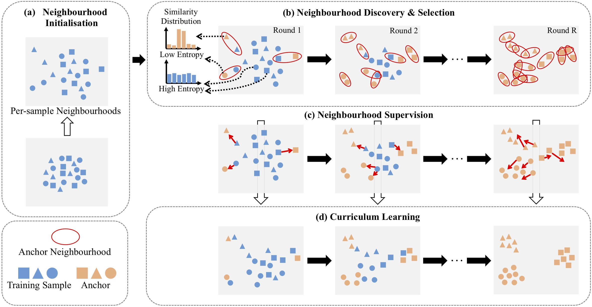
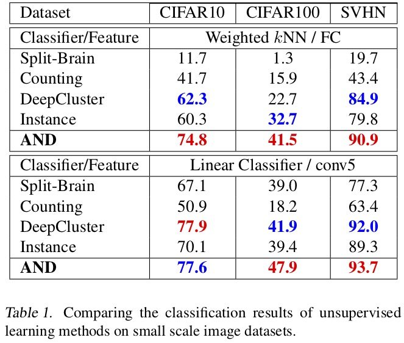
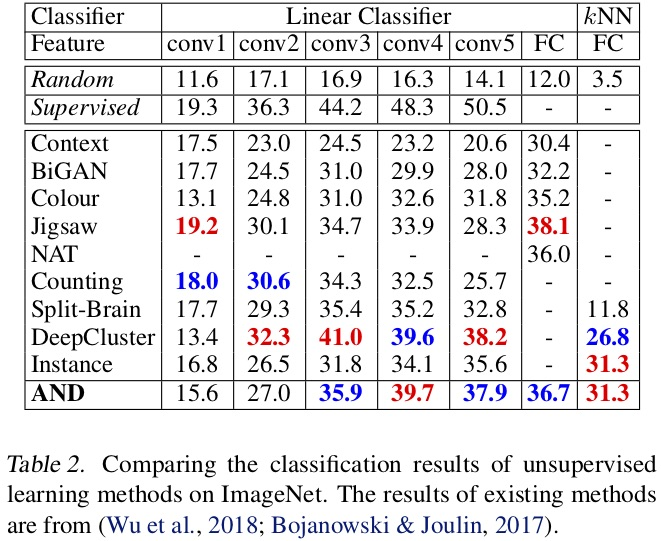

# AND: Anchor Neighbourhood Discovery

*Accepted by 36<sup>th</sup> International Conference on Machine Learning (ICML 2019)*.

Pytorch implementation of [Unsupervised Deep Learning by Neighbourhood Discovery](https://arxiv.org/abs/1904.11567). 


<!---->

## Highlight
+ We propose the idea of exploiting local neighbourhoods for unsupervised deep learning. This strategy preserves the capability of clustering for class boundary inference whilst minimising the negative impact of class inconsistency typically encountered in clusters.
+ We formulate an *Anchor Neighbourhood Discovery (AND)* approach to progressive unsupervised deep learning. The AND model not only generalises the idea of sample specificity learning, but also additionally considers the originally missing sample-to-sample correlation during model learning by a novel neighbourhood supervision design.
+ We further introduce a curriculum learning algorithm to gradually perform neighbourhood discovery for maximising the class consistency of neighbourhoods therefore enhancing the unsupervised learning capability.

## Main results
The proposed AND model was evaluated on four object image classification datasets including CIFAR 10/100, SVHN and ImageNet12. Results are shown at the following tables:


<!---->


<!---->

## Reproduction

### Requirements
Python 2.7 and Pytorch 1.0 are required. Please refer to `/path/to/AND/requirements.yaml` for other necessary modules. Conda environment we used for the experiments can also be rebuilt according to it.

### Usages

1. Clone this repo: `git clone https://github.com/Raymond-sci/AND.git`
2. Download datasets and store them in `/path/to/AND/data`. (Soft link is recommended to avoid redundant copies of datasets)
2. To reproduce our reported result of ResNet18 on CIFAR10, please use the following command:`python main.py --cfgs configs/base.yaml configs/cifar10.yaml`
3. Running on GPUs: code will be run on CPU by default, use this flag to specify the gpu devices which you want to use
4. To evaluate trained models, use `--resume` to set the path of the generated checkpoint file and use `--test-only` flag to exit the program after evaluation

Every time the `main.py` is run, a new session will be started with the name of current timestamp and all the related files will be stored in folder `sessions/timestamp/` including checkpoints, logs, etc.

### Pre-trained model
To play with the pre-trained model, please go to [ResNet18](https://drive.google.com/file/d/1tMopB0iLPaJzw81tqZuXbK6YYAQRLXA-/view?usp=sharing) / [AlexNet](https://drive.google.com/file/d/1SeLi34LxuThcLulBaWViwy3kLYQQWX0l/view?usp=sharing). A few things need to be noticed:
+ The model is saved in **pytorch** format
+ It expects RGB images that their pixel values are normalised with the following mean RGB values `mean=[0.485, 0.456, 0.406]` and std RGB values `std=[0.229, 0.224, 0.225]`. Prior to normalisation the range of the image values must be `[0.0, 1.0]`.

## License
This project is licensed under the MIT License. You may find out more [here](./LICENSE).

## Reference
If you use this code, please cite the following paper:

Jiabo Huang, Qi Dong, Shaogang Gong and Xiatian Zhu. "Unsupervised Deep Learning by Neighbourhood Discovery." Proc. ICML (2019).

```
@InProceedings{huang2018and,
  title={Unsupervised Deep Learning by Neighbourhood Discovery},
  author={Jiabo Huang, Qi Dong, Shaogang Gong and Xiatian Zhu},
  booktitle={Proceedings of the International Conference on machine learning (ICML)},
  year={2019},
}
```